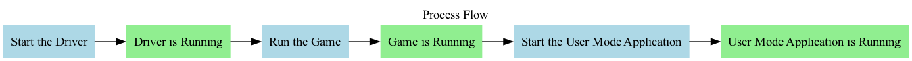

# The-Kernel-Driver-GUIDE


# What this project is

This project is a comprehensive tool designed for interacting with a game at a low level, primarily intended for creating cheats or mods. It consists of a kernel driver located in the "KernelReadWriteDriver" directory and a user mode application with a graphical user interface, located in the "KernelReadWriteDriver_UserMode_IMGUI" directory.

The kernel driver provides essential functionality for reading from and writing to virtual memory, enabling users to manipulate various aspects of the game's state. Meanwhile, the user mode application utilizes this functionality to implement a range of features, including an aimbot, while also offering a user-friendly interface for configuring these features.

To maintain organization and ease of use, the project is neatly structured with separate directories for the kernel driver and the user mode application. Additionally, it comes with several supplementary resources, such as a font file named "arial.ttf", a Cheat Engine table named "assaultcube.CT", and a PowerShell script for automated installation labeled "autoinstall.ps1".

## Welcome to The Kernel Driver Guide

Hello and welcome to this comprehensive guide. Please read through carefully to avoid any mistakes. This guide is designed to provide a straightforward walkthrough for creating a simple kernel driver for Windows.
If you would like to support this project and don't feel like compiling the binaries yourself, go to [patreon](https://www.patreon.com/icysponge/shop) to get the pre-compiled binaries.

### Showcase Video

You can watch a showcase video [here](https://www.youtube.com/watch?v=uPxO-6N00NI&ab_channel=CollinEdward).

## Sequence of running the application in the right order

The process of running the applications in the correct order involves the following steps:

1. Start the Driver
2. Run the Game
3. Start the User Mode Application

The flowchart below illustrates this process:



Each step is represented by a box, and the arrows represent the flow from one step to the next. The boxes filled with light green color indicate that the corresponding application is running.

---

## Prerequisites

> [!IMPORTANT]
Before you begin, ensure that you have the following:

- A Windows machine with Secure Boot disabled
- At least 4 GB RAM on your Windows machine
- [Windows Redistributable](https://download.visualstudio.microsoft.com/download/pr/a061be25-c14a-489a-8c7c-bb72adfb3cab/4DFE83C91124CD542F4222FE2C396CABEAC617BB6F59BDCBDF89FD6F0DF0A32F/VC_redist.x64.exe)
- [DirectX]([https://download.microsoft.com/download/1/7/1/1718CCC4-6315-4D8E-9543-8E28A4E18C4C/dxwebsetup.exe](https://www.microsoft.com/en-us/download/details.aspx?id=6812))

### Disabling Secure Boot

1. **Restart your computer:** Access the BIOS/UEFI settings by pressing F2, F10, or Delete (based on your computer's manufacturer).
2. **Locate Secure Boot:** Find the Secure Boot setting in the "Security" or "Trusted Platform Module (TPM)" section.
3. **Disable Secure Boot:** Save the settings and boot into Windows.

## Additional Tips for Disabling Secure Boot

> [!TIP]
Back up your data before disabling Secure Boot.

> [!IMPORTANT]
> Disable Secure Boot only when necessary, such as running virtual machines or specific software.

> [!CAUTION]
>  Re-enable Secure Boot to protect your computer once done with the required tasks.


## Download and Setup

To develop a kernel driver, set up your environment by downloading the following requirements:

1.1 **Install Visual Studio 2022:** [Download Link](https://visualstudio.microsoft.com/downloads/)

1.2 - Install Desktop Development With C++
1.3 Install Individual components listed:  
  - C++ ATL for latest v143 build tools with Spectre Mitigations (ARM64/ARM64EC)
  - C++ ATL for latest v143 build tools with Spectre Mitigations (x86 & x86)
  - C++ MFC for latest v143 build tools with Spectre Mitigations (ARM64/ARM64EC)
  - MSVC v143 - VS 2022 C++ ARM64/ARM64EC Spectre-mitigated libs (Latest)
  - MSVC v143 - VS 2022 C++ x64/x86 Spectre-mitigated libs (Latest)


2 **Install Windows SDK:** [Download Link](https://developer.microsoft.com/en-us/windows/downloads/windows-sdk/)
3 **Install Windows Driver Kit (WDK):** [Download Link](https://learn.microsoft.com/en-us/windows-hardware/drivers/download-the-wdk)

- Follow [this tutorial](https://learn.microsoft.com/en-us/windows-hardware/drivers/download-the-wdk) if the above WDK link is outdated.
- When installing components for Visual Studio 2022, select "Desktop development with C++" and specific individual components as listed in the guide.

#### Installing Debug View

- Download Debug View: [Direct Link](https://download.sysinternals.com/files/DebugView.zip) or [Sysinternals Website](https://learn.microsoft.com/en-us/sysinternals/downloads/debugview)

---

## Visual Studio 2022 Project Setup

1. **Create a new kernel mode driver project:** Choose "Kernel Mode Driver, Empty (KMDF)" in Visual Studio.
   - Right-click on the project.
   - Activate "Use Local Time" and Enable Active(Release).
   - Navigate to "Linker" -> "Command Line" and add "/INTEGRITYCHECK".
   - Add a class with the same name as the project.

---

## Creating and Running the Driver (Using Debug View)

1. **Add a new header file:** Name it "messages.h" in the Header Files folder.
2. **Define a function:** Create a function called `debug_message` that takes a string and extra parameters.
3. **Include the header file:** Add "messages.h" in your source file.
4. **Create functions:** 
   - `driver_entry` that takes a `PDRIVER_OBJECT` and a `PUNICODE_STRING`.
   - `unload_driver` that takes a `PDRIVER_OBJECT`.
   - Call `debug_message` to print a message when the driver starts and stops.
5. **Compile the driver.**

---

## Setting Up Kernel Driver (Using `sc create` command)

1. **Set Kernel driver Bin Path:** Use `sc create` command.
   - Replace "computer name" with your actual computer name and "KernelReadWriteDriver.sys" with your .sys file name.

   ```
   sc create KernelReadWriteDriver type= Kernel Binpath="C:\Users\computer name\source\repos\KernelReadWriteDriver\x64\Release\KernelReadWriteDriver.sys"
   ```

2. **Enable test signing:** Use the command:
   ```
   bcdedit /set testsigning on
   ```

3. **Start DebugView in ADMIN mode.**
4. **Enable Capture Kernel In Debug View.**

5. **Load the driver using the sc command:**
   ```
   sc start "kernel driver name"
   ```

> [!TIP]
> When and if encountering an error do the following:

5.1
    Run the following command in ADMIN cmd and restart:
     ```
     bcdedit /set nointegritychecks on
     ```

6. **Stop the driver using the sc command:**
   ```
   sc stop "kernel driver name"
   ```

## Sequence of running the application in the right order


---

## How Everything in it Works

Before we congratulate you on completing The-Kernel-Driver-Tutorial, let's understand how everything works:

- **Secure Boot:** Disabled to allow the execution of kernel drivers.
- **Visual Studio Setup:** Establishes a development environment.
- **WDK and SDK:** Essential tools for kernel mode driver development.
- **Debug View:** Monitors debug output from the driver.

### Driver Functionality

- **Driver Entry:** Initializes the kernel driver when loaded into the Windows kernel.
- **Unload Driver:** Handles cleanup when the driver is unloaded.
- **Debug Message:** Prints diagnostic messages for debugging purposes.

### Kernel-to-User Communication

1. **Driver Setup:** The kernel driver is compiled and integrated into the Windows kernel using `sc create` command.
2. **User Space Application:** Develop a user-space application that communicates with the kernel driver.
3. **Communication Mechanism:** Use Windows API or custom communication mechanisms like IOCTLs for communication between user and kernel space.

### Driver Execution

1. **Test Signing:** Enabled to allow the loading of the kernel driver during development.
2. **DebugView:** Captures debug messages for monitoring driver execution.
3. **Driver Load and Unload:** The driver is loaded and unloaded using the `sc start` and `sc stop` commands.

---

## Congratulations!

Congratulations on completing The-Kernel-Driver-Tutorial! You've successfully set up your development environment, disabled Secure Boot, created a simple kernel driver for Windows, and gained insights into kernel-to-user communication. This foundation opens doors to advanced driver development and system-level interactions.

---

## Cheat Table Content for Assaulted Cube Process

- Cheat entries can be found in [cheat-entries.md](cheat-entries.md) or by downloading the [assaultcube.CT](assaultcube.CT) file. Run it with Cheat Engine while playing the [game](https://github.com/assaultcube/AC/releases/tag/v1.3.0.2).

---

## Honorable Mentions

Special thanks to the following resources and explanation videos:

- [Video 1](https://www.youtube.com/watch?v=6TBQ7lWYQ0g)
- [Video 2](https://www.youtube.com/watch?v=EaxaQYESDlM)
- [Video 3](https://www.youtube.com/watch?v=KzD_nc5B_8w)
- [Video 4](https://www.youtube.com/watch?v=eumG222Efzs)
- [Video 5](https://www.youtube.com/watch?v=8oC0w6WhZ1E)
